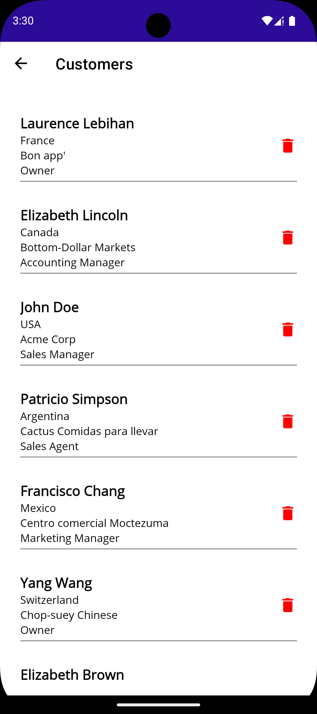
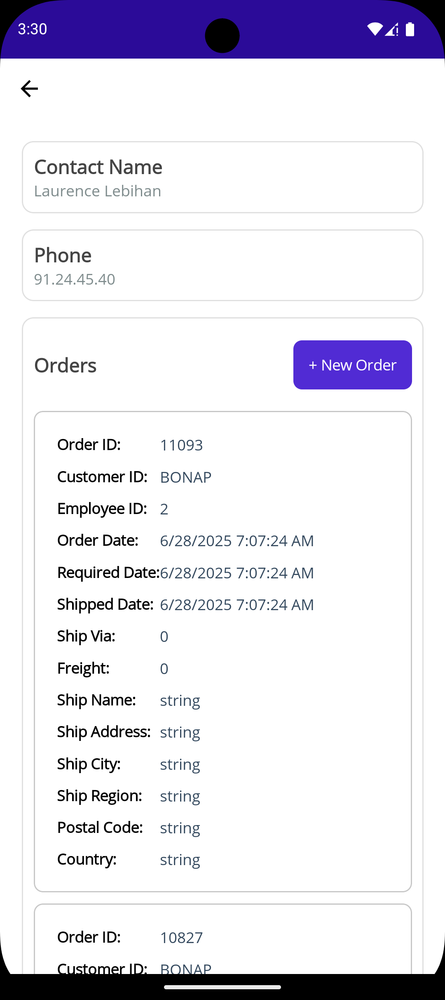
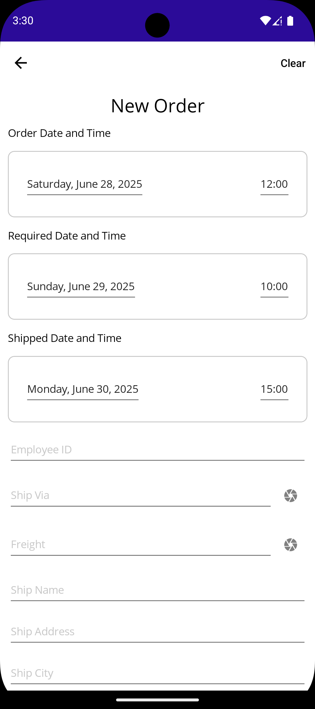
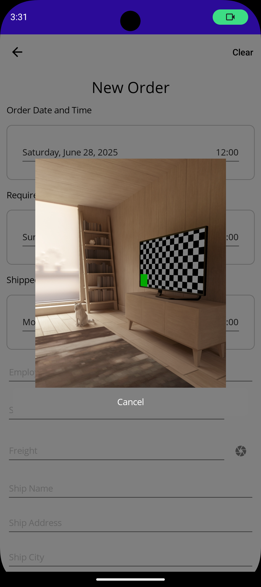

# 📱 NorthwindClient

**NorthwindClient** is a cross-platform mobile application built with **.NET MAUI (.NET 9)**, designed to run on **Android and iOS**. It interacts with the Northwind API to manage customers and orders, and includes barcode scanning, state management, exception handling, and modern MVVM patterns.

---

## 🚀 Features

- 🧭 App Shell Navigation (multi-page)
- 📦 CRUD operations for Customers & Orders
- 🕹️ State management per screen: `Init`, `Success`, `Error`
- 📷 Barcode scanning (Android & iOS) using **ZXing.Net.MAUI**
- ❌ Global Exception Handling
- 📡 API service integration via `IApiService`
- 🔥 Firebase integration (WIP – Push Notifications)

---

## 🔧 Backend Server Requirements

This mobile app requires the **MyNorthwind** backend server to be running. The server must be configured to run on **port 5100** for the APK to work properly.

### Backend Repository
- **Repository**: [MyNorthwind](https://github.com/xuanlocle/MyNorthwind)
- **Required Port**: `5100`
- **API Base URL**: `http://localhost:5100/api`

### Quick Setup
1. Clone the backend repository:
   ```bash
   git clone https://github.com/xuanlocle/MyNorthwind.git
   cd MyNorthwind
   ```

2. Run the server on port 5100:
   ```bash
   # Using Docker (recommended)
   docker-compose up -d
   
   # Or using .NET CLI
   dotnet run --urls "http://localhost:5100"
   ```

3. Verify the server is running:
   ```bash
   curl http://localhost:5100/api/customers
   ```

**⚠️ Important**: The mobile app is configured to connect to `localhost:5100`. If you change the server port, you'll need to update the app's configuration.

---
# Project Assets

Customer List             |  Details
:-------------------------:|:-------------------------:
  |  

New Order             |  Scan Barcode
:-------------------------:|:-------------------------:
  |  


https://github.com/user-attachments/assets/bccbab2f-679f-4906-a44f-bb2133656f0c

https://github.com/user-attachments/assets/8d423a68-eeed-474d-9fa4-5c052805864e


---

## 📦 Project Structure

~~~
/NorthwindClient
├── Models/ # OrderModel, CustomerModel, etc.
├── ViewModels/ # MVVM Toolkit ViewModels
├── Views/ # XAML pages
├── Services/ # Navigation & API abstraction
├── Infrastructure/ # Utility, constants, base classes
├── Resources/
│ ├── Fonts/
│ └── Images/
├── AppShell.xaml # MAUI Shell Navigation
├── MauiProgram.cs # Dependency Injection & startup
└── Platforms/ # Android & iOS configurations
~~~

## Try apk: 
[com.darrenle.northwind-Signed.apk](assets/com.darrenle.northwind-Signed.apk)

---

## 📷 Barcode Scanning

- Built with ZXing.Net.MAUI
- Opens popup on icon press
- Supports cancel button
- Validates barcode is numeric
- Auto-fills value into target entry

## 🔐 Configuration
- Base API URL securely stored in IAppConfig and injected via DI
- **Backend Server**: Must run on port 5100 (see Backend Server Requirements above)
- **API Endpoint**: Configured to connect to `http://localhost:5100/api`
- Consider using SecureStorage for auth/token if added in future

## ⚠️ Known TODOs
- Firebase push notifications
- User authentication & authorization
- Unit tests & UI test coverage

## 🤝 Contributing
Contributions are welcome! Open an issue for discussion or submit a PR directly.

## 📄 License
This project is open source and available under the MIT License.

Let me know if you'd like me to fill in Firebase setup, screenshots, or usage examples!
